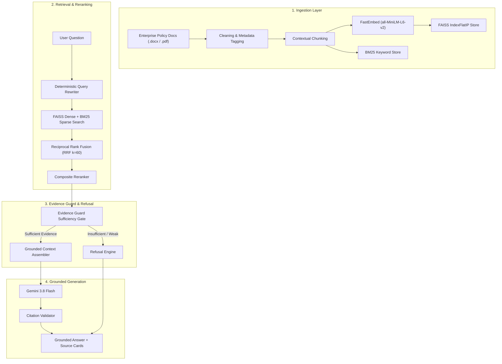

# Clause — Enterprise Document Intelligence & Evidence-Grounded RAG Assistant

> **Answers you can trust. Sources you can trace.**

[](https://www.python.org/)
[](https://streamlit.io/)
[](https://ai.google.dev/)
[](evaluation/EVALUATION.md)
[](evaluation/EVALUATION.md)
[](tests/)

---

## A. Overview
**Clause** is a production-grade, enterprise workplace policy RAG (Retrieval-Augmented Generation) assistant designed to eliminate hallucinations, enforce strict evidence sufficiency guardrails, and provide verifiable inline source citations for enterprise knowledge management.

Built with Python, FastEmbed, FAISS, BM25, Gemini 3.8 Flash, and Streamlit, Clause provides knowledge workers with instant, accurate answers grounded strictly in indexed corporate documentation. When evidence is missing or incomplete, Clause refuses to answer rather than fabricating policy details.

---

## B. Business Problem
Knowledge workers waste up to 20% of their work week manually searching through fragmented enterprise policy documents (HR guidelines, IT security protocols, expense limits, leave policies). Standard conversational LLMs are prone to hallucinations, generating plausible but incorrect policy statements that introduce compliance risks, financial liabilities, and administrative confusion.

---

## C. Solution
Clause bridges enterprise documents and AI assistance by implementing a multi-stage hybrid retrieval engine coupled with an **Evidence Guard** gating layer. Clause:
1. Indexes enterprise `.pdf` and `.docx` policy files into dense FAISS and sparse BM25 search stores.
2. Fuses search results via Reciprocal Rank Fusion (RRF) and reranks them deterministically.
3. Evaluates evidence sufficiency before invoking the LLM, triggering strict refusal when evidence is lacking.
4. Generates grounded answers with verified inline citation tags (`[S1]`, `[S2]`) linked directly to source documents and sections.

---

## D. Key Features

- **Multi-Format Ingestion**: Supports `.pdf` and `.docx` policy documents with text cleaning.
- **Context-Aware Chunking**: Metadata-preserving chunking (700 chars / 120 overlap) prepending section titles.
- **FastEmbed MiniLM Vector Embeddings**: `sentence-transformers/all-MiniLM-L6-v2` ONNX embedding pipeline.
- **FAISS Semantic Retrieval**: High-performance L2-normalized cosine similarity vector search (`IndexFlatIP`).
- **BM25 Keyword Retrieval**: Exact term matching for policy identifiers and numerical rules.
- **Reciprocal Rank Fusion (RRF)**: Merges dense and sparse search rankings ($k=60$).
- **Deterministic Reranking**: Composite scoring based on RRF rank, set query coverage, and exact code matches.
- **Query Rewriting & Expansion**: Normalizes enterprise abbreviations (`WFH`, `MFA`, `PTO`) while preserving policy codes.
- **Evidence Guard Sufficiency Gate**: Evaluates evidence strength and token alignment prior to generation.
- **Categorical Confidence Badging**: Assigns `High`, `Moderate`, or `Insufficient` confidence ratings.
- **Conflict Awareness**: Detects contradictory policy clauses (e.g. *"allowed"* vs *"prohibited"*).
- **Gemini 3.8 Flash Grounding**: System-prompt constrained LLM generation ($T=0.0$).
- **Inline Source Attribution**: Bracketed citation tags (`[S1]`, `[S2]`) mapped to source cards.
- **Zero-Hallucination Refusal**: Strict, standard refusal when query is unsupported.
- **Multi-Document Synthesis**: Merges evidence across multiple policy documents.
- **Document Management**: Upload and live re-indexing interface in Streamlit.
- **Evaluation Dashboard**: Interactive benchmark metric viewer and detailed query execution table.
- **Enterprise SaaS UI**: Warm ivory and forest green shell matching professional SaaS standards.

---

## E. Architecture



---

## F. Retrieval Architecture

- **Embedding Model**: `sentence-transformers/all-MiniLM-L6-v2` (384 dimensions).
- **Embedding Backend**: `FastEmbed` / ONNX Runtime for fast CPU inference without PyTorch bloat.
- **Vector Store**: `FAISS IndexFlatIP` with L2-normalized vector embeddings.
- **Keyword Retrieval**: `rank-bm25` (BM25Okapi).
- **Rank Fusion**: Reciprocal Rank Fusion (RRF) with constant $k=60$.
- **Reranking**: Composite scoring combining RRF rank ($40\%$), query coverage ($35\%$), section title match, and policy code identifier boost.

---

## G. Evidence Guard

The **Evidence Guard** evaluates retrieved evidence prior to LLM generation:
- **Sufficiency Rating**: Assigns categorical labels (`High`, `Moderate`, `Insufficient`).
- **Token Coverage**: Computes exact whole-word coverage of substantive query keywords against retrieved chunks.
- **Identifier Check**: Verifies presence of exact enterprise policy codes (e.g. `HR-RW-017`).
- **Conflict Detection**: Scans for contradictory terms across retrieved evidence chunks.
- **Refusal Decision**: Intercepts weak evidence (`token_cov < 0.15` and no policy ID), bypassing the LLM call entirely.

---

## H. Hallucination Prevention

When evidence is missing or insufficient, Clause refuses to answer, returning the exact refusal notice:

> *"I could not find sufficient information in the provided documents to answer this question."*

Clause achieves a **100.0% Correct Refusal Rate** on benchmark testing.

---

## I. Demonstration Corpus

> **Disclosure**: The included policy documents are project-authored synthetic demonstration data created for testing and evaluation purposes. They do not represent real enterprise policies.

| Document File | Policy Code | Version | Policy Subject Area |
| :--- | :---: | :---: | :--- |
| **`Remote Work Policy.docx`** | `HR-RW-017` | 3.2 | Remote work eligibility, probationary WFH (90 days), core hours, equipment |
| **`Information Security Policy.docx`** | `SEC-IS-002` | 5.1 | Multi-factor authentication (MFA), password rules (16+ chars), device security |
| **`Travel & Business Expense Policy.docx`** | `FIN-EXP-011` | 4.0 | Receipt threshold ($25), meal per diem ($75/day), non-reimbursable items |
| **`Annual Leave & Paid Time Off Policy.docx`** | `HR-LV-004` | 2.1 | PTO accrual (1.66 days/mo, 20 days/yr), rollover (max 5 days), notice window |
| **`Employee Code of Conduct Policy.docx`** | `HR-COC-005` | 1.8 | Gift limits ($50 cap), conflicts of interest, anti-harassment policy |
| **`Employee Benefits & Wellness Policy.docx`** | `HR-BEN-006` | 2.0 | Health insurance, wellness stipend ($500/yr), 401(k) match (4%), commuter stipend |

---

## J. Evaluation Methodology

The 24-question offline benchmark dataset (`evaluation/rag_evaluation_dataset.csv`) measures:
- **Retrieval Hit@1 & Hit@3**: Rank of target document in search results.
- **Mean Reciprocal Rank (MRR)**: Average reciprocal rank across supported questions.
- **Expected Source Accuracy**: Top document match rate for answered queries.
- **Correct Refusal Rate**: Accuracy in refusing unsupported queries (`refused = True`).
- **Grounding Validation Rate**: Verification of valid inline source citations.

---

## K. Evaluation Results

```
==================================================================
CLAUSE Enterprise RAG — Benchmark Evaluation Summary
==================================================================
Total Questions Evaluated:    24
Supported Questions:          18
Unsupported Questions:        6
------------------------------------------------------------------
Retrieval Hit@1 Rate:         94.4%
Retrieval Hit@3 Rate:         100.0%
Mean Reciprocal Rank (MRR):   0.963
Expected Source Accuracy:     100.0%
Correct Refusal Rate:         100.0% (6/6 unsupported questions)
Grounding Validation Rate:    100.0%
Unit Test Suite Pass Rate:    100.0% (63/63 passing)
==================================================================
```

---

## L. UI / Product Experience

Clause features a 4-tab Streamlit interface:
1. **Ask**: Natural language search input, quick query chips, confidence badges, grounded answers, inline citations, and expandable Evidence Panel.
2. **Documents**: Policy inventory summary, vector index metadata, and document upload / re-indexing interface.
3. **Evaluation**: Benchmark summary scorecards, category metric breakdowns, and interactive 24-question test table.
4. **System**: Real-time component health, vector store statistics, memory consumption, and architecture specifications.

---

## M. Running Locally

### 1. PowerShell Setup (Windows)

```powershell
# Clone repository
git clone https://github.com/your-username/clause-enterprise-rag.git
cd clause-enterprise-rag

# Create and activate virtual environment
python -m venv .venv
.\.venv\Scripts\Activate.ps1

# Install requirements
pip install -r requirements.txt

# Create environment configuration file
copy .env.example .env
```

### 2. Configure API Key

Edit `.env` and insert your Gemini API Key:
```env
GEMINI_API_KEY=your_actual_gemini_api_key_here
GEMINI_MODEL=gemini-3.8-flash
```

### 3. Launch Application

```powershell
python -m streamlit run app.py
```
Open your browser to `http://localhost:8501`.

---

## N. Environment Variables

| Variable | Default Value | Description |
| :--- | :--- | :--- |
| `GEMINI_API_KEY` | *(Required)* | Google Gemini API Key |
| `GEMINI_MODEL` | `gemini-3.8-flash` | Gemini LLM Model Name |
| `DEFAULT_LLM_TEMPERATURE` | `0.0` | Generation temperature |
| `EMBEDDING_MODEL` | `sentence-transformers/all-MiniLM-L6-v2` | Embedding model |
| `VECTORSTORE_DIR` | `vectorstore` | FAISS index output directory |
| `CLAUSE_CACHE_DIR` | `""` | Optional portable cache directory |

---

## O. Testing

Run the full pytest suite (63 unit tests):

```powershell
.\.venv\Scripts\pytest -q
```

---

## P. Evaluation

Run the deterministic 24-question offline benchmark evaluation:

```powershell
.\.venv\Scripts\python evaluate_rag.py
```

---

## Q. Rebuilding Demo Corpus

Re-generate the 6 synthetic DOCX documents and update vector store indices:

```powershell
python scripts/create_demo_corpus.py
python scripts/index_final_corpus.py
```

---

## R. Deployment

### Primary Deployment: Streamlit Community Cloud (Recommended)
Clause is optimized for one-click deployment on **Streamlit Community Cloud** directly from GitHub:
- **Repository**: `aditi130806/clause-enterprise-rag`
- **Branch**: `main`
- **Main file path**: `app.py`
- **Secrets Setup**: Set `GEMINI_API_KEY` and `GEMINI_MODEL` under **Advanced Settings -> Secrets** in Streamlit Community Cloud.

### Alternative Deployment: Google Cloud Run (Optional)
For enterprise container deployment on GCP, see the full guide in [docs/DEPLOYMENT.md](docs/DEPLOYMENT.md).

---

## S. Limitations

- **OCR**: Scanned image-only PDFs require OCR preprocessing not currently integrated.
- **Complex Tables**: Nested tables lose structural formatting during text extraction.
- **DOCX Page Numbers**: Page numbers in DOCX files default to section indices due to format limitations.
- **Synthetic Data**: Included policy corpus is demonstration data and requires domain calibration for production enterprise corpora.

---

## T. Future Improvements

- Tesseract / Vision OCR integration for scanned PDF documents.
- Role-Based Access Control (RBAC) for document security filtering.
- Learned cross-encoder reranking models.
- Enterprise Single Sign-On (SSO) integration.

---

## U. Repository Structure

```
clause-enterprise-rag/
├── app.py                      # Main Streamlit application shell
├── requirements.txt            # Python dependencies
├── Dockerfile                  # Container definition for Cloud Run
├── .dockerignore               # Docker build ignore rules
├── .gitignore                  # Git tracking ignore rules
├── .env.example                # Environment template (no secrets)
├── README.md                   # Primary project documentation
├── LICENSE                     # MIT License
├── .streamlit/                 # Streamlit UI theme configuration
│   └── config.toml
├── assets/                     # UI visual references and logos
├── data/                       # Document storage
│   ├── documents/              # Synthetic DOCX policy corpus
│   └── README.md               # Corpus disclosure notice
├── evaluation/                 # Benchmark evaluation dataset & results
│   ├── rag_evaluation_dataset.csv
│   ├── rag_evaluation_dataset.json
│   ├── evaluation_results.csv
│   └── evaluation_results.json
├── docs/                       # Comprehensive documentation
│   ├── ARCHITECTURE.md         # System architecture & Mermaid specs
│   ├── EVALUATION.md           # Benchmark evaluation methodology
│   ├── DEMO_GUIDE.md           # 3-minute live demonstration script
│   ├── DEPLOYMENT.md           # Google Cloud Run deployment guide
│   ├── PROJECT_REPORT.md       # Capstone technical project report
│   └── screenshots/            # UI screenshot catalog guide
├── scripts/                    # Utility & build scripts
│   ├── create_demo_corpus.py   # Corpus generator
│   └── index_final_corpus.py   # Vectorstore indexing script
├── src/                        # Core application source code
│   ├── config.py               # System parameters
│   ├── models.py               # Pydantic / Dataclass models
│   ├── ingestion.py            # PDF / DOCX parsers & chunker
│   ├── retrieval.py            # FastEmbed, FAISS & BM25 engine
│   ├── reranker.py             # Composite reranker & token coverage
│   ├── query_rewriter.py       # Query normalizer & expander
│   ├── evidence_guard.py       # Sufficiency gate & conflict detector
│   ├── rag_pipeline.py         # Main RAG pipeline orchestrator
│   ├── llm_service.py          # Gemini 3.8 Flash SDK wrapper
│   ├── citation_validator.py   # Citation parser & validator
│   └── evaluation.py           # Evaluation runner engine
├── tests/                      # Pytest unit & integration tests (63 tests)
└── vectorstore/                # FAISS vector store & BM25 index binaries
```
