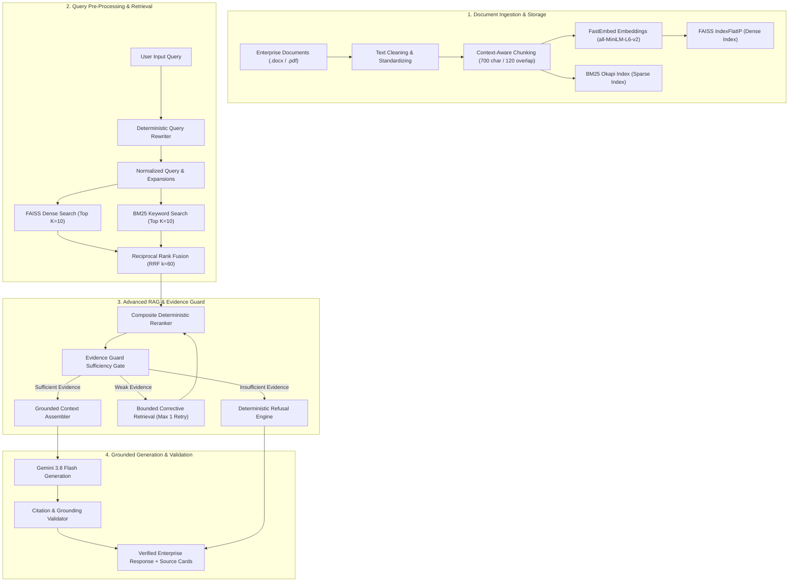
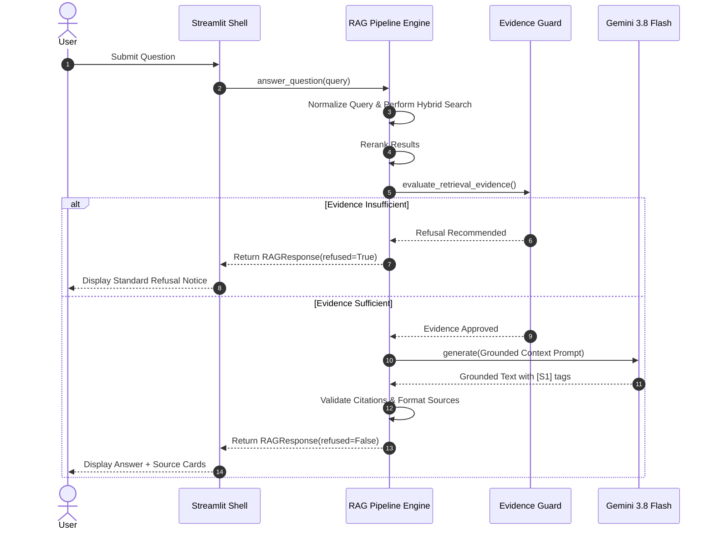

# Clause Enterprise RAG — System Architecture & Technical Specifications

## 1. Overview & Architectural Philosophy

**Clause** is built upon a deterministic, evidence-grounded Retrieval-Augmented Generation (RAG) pipeline engineered specifically for high-stakes enterprise workplace policy applications. 

Unlike standard conversational AI systems that hallucinate when information is missing or incomplete, Clause implements an **Evidence Guard** pattern that evaluates evidence sufficiency *before* calling the LLM, guaranteeing zero-hallucination refusal behavior (`100.0% Correct Refusal Rate`) for unsupported queries while delivering high precision (`94.4% Hit@1`, `100.0% Hit@3`, `0.963 MRR`) for supported enterprise inquiries.

---

## 2. End-to-End System Pipeline Architecture

---

## 3. Subsystem Breakdown

### 3.1 Document Ingestion & Contextual Chunking
- **Supported Formats**: `.pdf` (via `PyPDF`) and `.docx` (via `python-docx`).
- **Context-Aware Chunking**: Text is split into `700-character` chunks with `120-character` overlap.
- **Context Enrichment**: Each chunk is prepended with parent document title and section headings to preserve metadata context during embedding vectorization.

### 3.2 Hybrid Retrieval Engine
- **Dense Embedding Model**: `sentence-transformers/all-MiniLM-L6-v2` via `FastEmbed` / ONNX Runtime (`384-dimensional` vectors).
- **Dense Vector Store**: `FAISS IndexFlatIP` with L2-normalized vectors for exact cosine similarity search.
- **Sparse Keyword Store**: `rank-bm25` (BM25Okapi algorithm) for exact policy identifier and numeric token matching.
- **Fusion Layer**: **Reciprocal Rank Fusion (RRF)** combines dense and sparse ranks with constant $k=60$:
  $$\text{RRF Score}(d) = \sum_{m \in M} \frac{1}{k + r_m(d)}$$

### 3.3 Advanced RAG Intelligence Layer
- **Deterministic Reranker**: Reranks top candidates using composite scoring:
  $$\text{Score} = (0.40 \times \text{RRF}) + (0.35 \times \text{QueryCoverage}) + \text{SectionCoverage} + \text{IdentifierBoost}$$
- **Query Coverage**: Calculates word-level overlap of substantive domain subject keywords against retrieved chunk text using strict whole-word set matching.

### 3.4 Evidence Guard & Sufficiency Gate
- Evaluates evidence score, token coverage, and presence of exact policy codes (e.g. `HR-RW-017`).
- Assigns categorical **Confidence Labels**:
  - **High**: $\text{Score} \ge 0.35$
  - **Moderate**: $0.20 \le \text{Score} < 0.35$
  - **Insufficient**: $\text{Score} < 0.20$ or $\text{Token Coverage} < 0.15$
- **Strict Refusal**: Immediately returns standard refusal when evidence is insufficient, bypassing LLM generation to eliminate hallucinations.
- **Conflict Detection**: Scans retrieved sources for contradictory policy keywords (e.g., *"allowed"* vs *"prohibited"*).

### 3.5 Grounded Generation & Citation Validation
- **LLM Engine**: Google Gemini 3.8 Flash (`gemini-3.8-flash`) configured with temperature $0.0$.
- **Prompt Grounding**: System prompt strictly restricts generation to supplied context and enforces bracketed inline citations `[S1]`, `[S2]`.
- **Validation**: Post-generation parser verifies every cited source tag against retrieved chunks. Uncited or fabricated tags trigger safety warnings.

---

## 4. Environment & Data Flow Specifications

